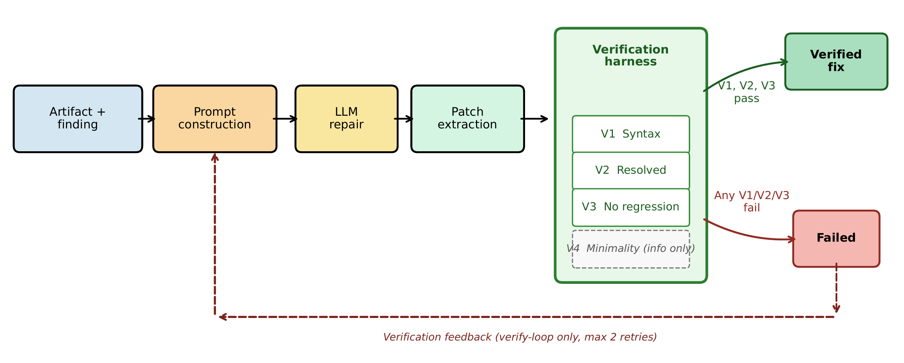
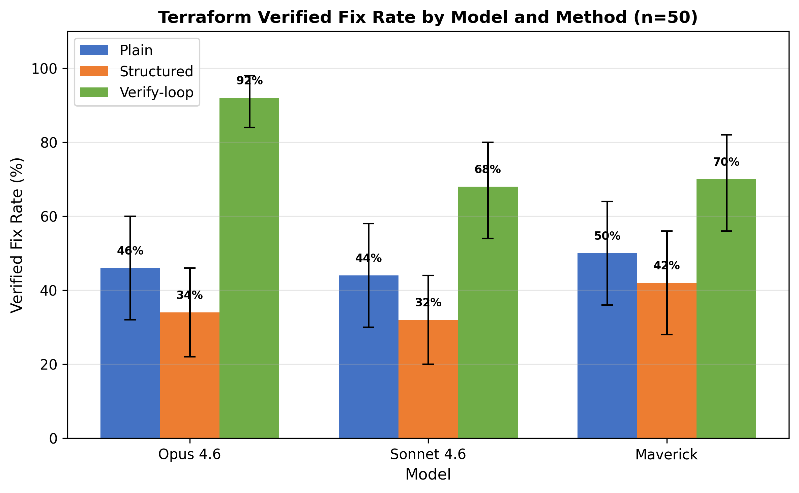
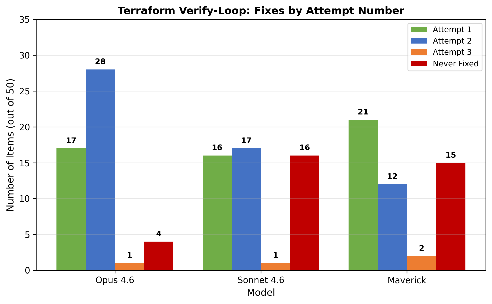

# IaC-Guard-V

### A Verification Framework for LLM-Generated Infrastructure-as-Code Repairs

[](LICENSE)
[](https://www.python.org/)
[](https://www.checkov.io/)
[](benchmark/)
[](runs/)

**Paper**: Under review at [IEEE QRS 2026](https://qrs26.techconf.org/) (26th International Conference on Software Quality, Reliability, and Security)

**Author**: [Lokesh Chauhan](https://github.com/lokesh0186)

---

## Overview

LLM-generated Infrastructure-as-Code repairs often *look* correct but silently introduce regressions or fail to resolve the target issue. IaC-Guard-V addresses this with a **four-gate verification framework** that evaluates repairs across multiple dimensions simultaneously.

<p align="center">
  
</p>
<p align="center"><em>Figure 1: IaC-Guard-V pipeline. An IaC artifact with a scanner finding is repaired by an LLM using one of three strategies. The verification harness evaluates the repair across four gates. In verify-loop mode, failed results are fed back to the LLM for iterative refinement.</em></p>

### The Four Verification Gates

| Gate | What It Checks | Type |
|------|---------------|------|
| **V1: Syntactic Validity** | Can the repaired file be parsed? | Binary |
| **V2: Target-Issue Resolution** | Is the original scanner finding gone? | Binary |
| **V3: Regression Safety** | Were any *new* findings introduced? | Binary |
| **V4: Patch Minimality** | How much of the file was changed? | Informational |

A repair is a **verified fix** only if it passes V1, V2, and V3 simultaneously.

---

## Key Findings

From **630 experimental runs** across 3 LLM families, 3 repair strategies, and 70 benchmark items:

1. **Syntactic validity is a poor proxy for correctness.** All models achieve 100% syntax validity, yet only 32--50% pass full verification under single-shot prompting.

2. **Verification-guided repair dramatically improves trustworthiness.** Iterative repair with scanner feedback achieves 68--92% verified-fix rates, statistically significantly outperforming baselines (McNemar's test, p < 0.001).

3. **Verification matters more than model capability.** An open-source model (Llama 4 Maverick) with verification outperforms the strongest commercial model (Claude Opus 4.6) without it --- at 1/12th the cost per verified fix.

4. **Structured prompting hurts Terraform repairs.** Constraining LLM output to JSON schema consistently degrades repair quality (32--42% vs. 44--50%), a counterintuitive result that reverses on Kubernetes.

---

## Results

### Verified-Fix Rate by Model and Strategy

<p align="center">
  
</p>
<p align="center"><em>Figure 2: Verified-fix rate by model and repair strategy (Terraform, n=50). Error bars show 95% bootstrap confidence intervals.</em></p>

#### Terraform (n=50 per cell)

| Model | Plain | Structured | Verify-Loop | 95% CI |
|:------|------:|-----------:|------------:|-------:|
| Claude Opus 4.6 | 46% | 34% | **92%** | 84--98% |
| Claude Sonnet 4.6 | 44% | 32% | **68%** | 54--80% |
| Llama 4 Maverick 17B | 50% | 42% | **70%** | 56--82% |

All verify-loop vs. structured comparisons significant at p < 0.001 (McNemar's exact test, Bonferroni-corrected). Effect sizes: Cliff's delta 0.28--0.58.

Full statistical tests: [`results/tables/statistical_tests.csv`](results/tables/statistical_tests.csv)

#### Kubernetes (n=20 per cell)

| Model | Plain | Structured | Verify-Loop |
|:------|------:|-----------:|------------:|
| Claude Opus 4.6 | 100% | 100% | **100%** |
| Claude Sonnet 4.6 | 100% | 100% | **100%** |
| Llama 4 Maverick 17B | 45% | 95% | **100%** |

Commercial models achieve perfect scores. The open-source model requires verification-guided iteration to match.

Full results: [`results/tables/main_results_with_ci.csv`](results/tables/main_results_with_ci.csv)

### Cost-Effectiveness

| Model | Method | VFR | Avg Tokens | Latency | Cost/Fix |
|:------|:-------|----:|-----------:|--------:|---------:|
| Maverick | Plain | 48.6% | 1,027 | 1.7s | $0.001 |
| **Maverick** | **Verify-Loop** | **78.6%** | **3,163** | **5.0s** | **$0.002** |
| Opus | Plain | 61.4% | 1,214 | 6.4s | $0.029 |
| **Opus** | **Verify-Loop** | **94.3%** | **3,320** | **15.2s** | **$0.047** |

Maverick with verify-loop produces more verified fixes per dollar than any commercial model configuration.

Full data: [`results/tables/cost_effectiveness.csv`](results/tables/cost_effectiveness.csv)

### Convergence Analysis

<p align="center">
  
</p>
<p align="center"><em>Figure 3: Distribution of fixes by attempt number. Most fixes occur in attempts 1--2; a third retry adds only ~2 percentage points.</em></p>

Full data: [`results/tables/convergence.csv`](results/tables/convergence.csv)

### Performance by Violation Class (Terraform, Verify-Loop)

| Violation Class | Plain | Verify-Loop | Improvement |
|:---------------|------:|------------:|------------:|
| Missing encryption | 83% | **97%** | +14pp |
| Public exposure | 17% | **94%** | +78pp |
| Weak observability | 56% | **83%** | +28pp |
| Over-permissive access | 46% | **71%** | +25pp |
| Network hardening | 33% | **67%** | +33pp |
| Other | 20% | **53%** | +33pp |
| Insecure defaults | 33% | **47%** | +13pp |

Values aggregated across all three models. Public exposure violations show the largest improvement, suggesting verification feedback is most valuable when initial fixes are likely incomplete.

Full breakdown by model: [`results/tables/results_by_violation_class.csv`](results/tables/results_by_violation_class.csv)

---

## Benchmark

70 misconfigured IaC artifacts sourced from [Checkov's](https://www.checkov.io/) official test suite (v3.2.517), spanning **70 unique scanner rules** across **8 violation classes**.

| Violation Class | Terraform | Kubernetes | Total |
|:---------------|----------:|-----------:|------:|
| Missing encryption | 12 | 2 | 14 |
| Over-permissive access | 8 | 6 | 14 |
| Network hardening | 8 | 3 | 11 |
| Public exposure | 6 | --- | 6 |
| Weak observability | 6 | 1 | 7 |
| Insecure defaults | 5 | 3 | 8 |
| Missing runtime safety | --- | 4 | 4 |
| Other | 5 | 1 | 6 |
| **Total** | **50** | **20** | **70** |

Selection used stratified sampling with deliberate over-sampling of minority classes to avoid inflating fix rates with easily repaired encryption misconfigurations.

- Benchmark artifacts: [`benchmark/raw/`](benchmark/raw/) (1,081 Terraform `.tf` + 2,400 Kubernetes `.yaml` from the full corpus)
- Selected items (Terraform): [`benchmark/selected_manifest_enriched.csv`](benchmark/selected_manifest_enriched.csv)
- Selected items (Kubernetes): [`benchmark/k8s_selected_manifest_enriched.csv`](benchmark/k8s_selected_manifest_enriched.csv)
- Full corpus manifest: [`benchmark/manifest.csv`](benchmark/manifest.csv)

---

## Models

| Model | Family | Type | Access |
|:------|:-------|:-----|:-------|
| Claude Opus 4.6 | Anthropic | Commercial | [AWS Bedrock](https://aws.amazon.com/bedrock/) |
| Claude Sonnet 4.6 | Anthropic | Commercial | [AWS Bedrock](https://aws.amazon.com/bedrock/) |
| Llama 4 Maverick 17B | Meta | Open-weight | [AWS Bedrock](https://aws.amazon.com/bedrock/) |

All experiments use temperature 0 for deterministic, reproducible outputs.

---

## Reproducing Results

### Requirements

- Python 3.10+
- [Checkov](https://www.checkov.io/) v3.2.517
- AWS account with [Amazon Bedrock](https://aws.amazon.com/bedrock/) access

```bash
pip install checkov==3.2.517 boto3
```

### Running Experiments

```bash
# Step 1: Run Checkov baselines on all benchmark items
python scripts/run_baseline_checkov.py

# Step 2: Run all 630 experiments (3 models x 3 methods x 70 items)
python scripts/run_full_experiments.py

# Step 3: Generate result tables and figures
python scripts/analyze_part1.py
python scripts/analyze_part2.py
python scripts/analyze_part3.py
```

### Using Pre-Computed Results

All 630 experimental runs are included in this repository. To verify results without re-running experiments:

```bash
# Regenerate tables and figures from existing run data
python scripts/analyze_part1.py
python scripts/analyze_part2.py
python scripts/analyze_part3.py
```

Output tables are written to [`results/tables/`](results/tables/) and figures to [`results/figures/`](results/figures/).

---

## Repository Structure

```
iac-guard-v/
├── benchmark/
│   ├── raw/                              # All benchmark artifacts
│   │   ├── BM-0001.tf ... BM-1081.tf    # 1,081 Terraform files
│   │   └── BM-2001.yaml ... BM-2400.yaml # 2,400 Kubernetes manifests
│   ├── selected_manifest_enriched.csv    # 50 selected Terraform items
│   ├── k8s_selected_manifest_enriched.csv # 20 selected K8s items
│   └── manifest.csv                      # Full corpus (3,481 items)
│
├── scripts/
│   ├── build_benchmark.py                # Benchmark construction
│   ├── build_k8s_benchmark.py            # K8s benchmark construction
│   ├── run_experiment.py                 # Main experiment runner
│   ├── run_full_experiments.py           # Orchestrator for all combos
│   ├── run_baseline_checkov.py           # Baseline scanner runs
│   ├── run_k8s_baseline.py              # K8s baseline runs
│   ├── call_bedrock.py                   # AWS Bedrock API caller
│   ├── verify_patch.py                   # 4-gate verification harness
│   ├── analyze_part1.py                  # Main results + statistics
│   ├── analyze_part2.py                  # Cost + minimality analysis
│   └── analyze_part3.py                  # Figures + stat tests
│
├── prompts/
│   ├── plain_v1.txt                      # Plain prompting template
│   ├── structured_v1.txt                 # Structured prompting template
│   └── retry_v1.txt                      # Verify-loop retry template
│
├── runs/
│   ├── raw/                              # 630 raw LLM responses
│   └── patches/                          # 630 extracted patches
│
├── results/
│   ├── tables/
│   │   ├── all_runs.csv                  # Complete results (630 rows)
│   │   ├── main_results_with_ci.csv      # VFR with confidence intervals
│   │   ├── cost_effectiveness.csv        # Cost per verified fix
│   │   ├── results_by_violation_class.csv # Breakdown by violation type
│   │   ├── statistical_tests.csv         # McNemar's + Cochran's Q
│   │   ├── convergence.csv               # Fixes by attempt number
│   │   ├── difficulty_terraform.csv      # Per-item difficulty
│   │   └── difficulty_kubernetes.csv     # Per-item difficulty
│   └── figures/
│       ├── figure1_pipeline.png          # Framework pipeline
│       ├── figure2_hero_vfr.png          # Main VFR results
│       └── figure3_convergence.png       # Convergence analysis
│
└── scanners/outputs/baseline/            # 70 Checkov baseline outputs
```

---

## Citation

If you use IaC-Guard-V in your research, please cite:

```bibtex
@inproceedings{chauhan2026iacguardv,
  title={{IaC-Guard-V}: A Verification Framework for {LLM}-Generated Infrastructure-as-Code Repairs},
  author={Chauhan, Lokesh},
  booktitle={Proceedings of the IEEE International Conference on Software Quality, Reliability, and Security (QRS)},
  year={2026}
}
```

---

## License

This project is licensed under the [Apache License 2.0](LICENSE). The benchmark items are derived from [Checkov's](https://github.com/bridgecrewio/checkov) open-source test suite (Apache 2.0).
